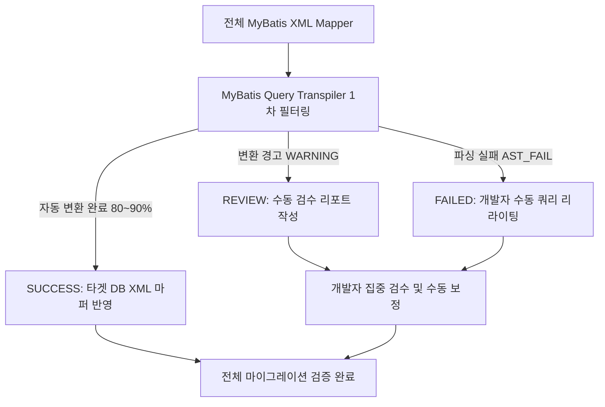

# 🚀 MyBatis Query Transpiler (AST-Based Multi-DB Migration Filter)

**MyBatis XML Mapper 및 SQL 쿼리를 AST(Abstract Syntax Tree) 기반으로 파싱하여 이기종 DB 간 1차 자동 필터링 및 변환을 수행하는 마이그레이션 지원 도구입니다.**
💡 **본 도구의 주 목적은 수백~~수천 개의 MyBatis 쿼리 중 80~~90% 이상을 자동 변환하여 1차로 필터링하고,
자동 변환이 불가능하거나 검수가 필요한 쿼리를 리포트 형태로 추출하여 개발자의 수동 공수를 최소화하는 것입니다.**

## 🎯 Project Scope & Strategy (프로젝트 목적 및 마이그레이션 전략)

이기종 DB 간 SQL 마이그레이션은 DB 엔진별 고유 함수, 비표준 구문, 복잡한 동적 태그 등으로 인해 **100% 완전 자동 변환이 불가능**합니다.

본 도구는 "100% 자동화"가 아닌 "효율적인 1차 자동 필터링 및 검수 리포팅"을 목표로 제작되었습니다.



1. **1차 자동 변환 (`SUCCESS`)**: 표준 SQL 문법 및 보편적 함수 변환을 자동 처리하여 타겟 DB XML 생성.
2. **검수 경고 감지 (`WARNING`)**: 오라클 `CONNECT BY`, MSSQL `WITH(NOLOCK)` 등 특수 구문 감지 시 자동 변환과 함께 리포트에 기록.
3. **수동 전환 리포팅 (`AST_FAIL` / `REVIEW`)**: 비표준 구문이나 파싱 불가 쿼리는 Fallback 처리 후 리포트(`migration_review.csv`)로 추출하여 **개발자가 검수해야 할 대상만 선별 제공**.

---

## ✨ Key Features

### 1. 🧬 AST 기반 1차 Multi-DB Transpilation

- **13개 이상 DB Dialect 변환 지원**: `oracle`, `postgres`, `mysql`, `mssql`, `sqlite`, `mariadb`, `duckdb`, `snowflake`, `redshift`, `clickhouse`, `bigquery`, `trino`, `db2` 등.
- **CDATA 및 XML Entity 완벽 보존**: `<![CDATA[ ... ]]>` 구문 처리 및 `&lt;`, `&gt;`, `&amp;` 등 HTML Entity 디코딩/재인코딩 지원.

### 2. 🛡️ MyBatis 동적 문법 구조 보존 (Masking Architecture)

- 파라미터(`#{param}`, `${param}`) 및 동적 태그(`<if>`, `<where>`, `<foreach>`, `<choose>` 등)를 AST 파싱 전 마스킹 처리 후 역순 언마스킹하여 **MyBatis XML 원본 구조 보존**.

### 3. 🔍 수동 검수 대상 추출 & Diff 뷰어 (GUI / CLI)

- **📊 검수 전용 GUI 뷰어**:
- **[원본 SQL vs 변환 SQL]** 좌우 대조(Diff) 화면 제공.
- 미완료/경고 항목만 선별하여 개발자가 빠르게 수동으로 확인 및 수정 가능.

- **⚡ CLI & CSV Report**: 마이그레이션 실행 즉시 `migration_review.csv`를 생성하여 수동 검수 목록 자동 제공.

---

## ⚠️ 수동 검수 대상 / 워닝(WARNING) & 미전환 분류 매트릭스

마이그레이션 실행 후 아래 항목에 해당하는 쿼리는 개발자의 수동 확인 및 보정(Review & Manual Rewrite)이 필요합니다.

| 상태 (Status)     | 소스 ➔ 타겟 DB   | 감지 패턴 / 사유                      | 변환 동작 및 수동 조치 가이드                                                        |
| ----------------- | ---------------- | ------------------------------------- | ------------------------------------------------------------------------------------ |
| **`WARNING`**     | Oracle ➔ 타 DB   | **오라클 계층형 쿼리 (`CONNECT BY`)** | 표준 `WITH RECURSIVE` (CTE) 구문으로 1차 전환 ➔ **계층 정렬 및 성능 수동 검수 필요** |
| **`WARNING`**     | Oracle ➔ 타 DB   | **`ROWNUM` 구문 포함**                | `LIMIT` / `FETCH` 전환 확인 ➔ **페이징 범위 및 정렬 조건 수동 검수 필요**            |
| **`WARNING`**     | MSSQL ➔ 타 DB    | **테이블 힌트 `WITH(NOLOCK)**`        | `WITH(NOLOCK)` 자동 제거 ➔ **타 DB 트랜잭션 격리 수준 수동 검수 필요**               |
| **`WARNING`**     | MySQL ➔ Postgres | **`ON DUPLICATE KEY UPDATE`**         | Postgres `ON CONFLICT DO UPDATE SET` 구문으로 자동 변환 ➔ **인덱스 조건 수동 확인**  |
| **`WARNING`**     | Postgres ➔ MySQL | **`RETURNING` 구문 포함**             | MySQL 미지원으로 `RETURNING` 제거 ➔ **KeyHolder 또는 `LAST_INSERT_ID()` 수동 구현**  |
| 🛑 **`AST_FAIL`** | 공통 (All)       | **AST 파싱 실패 / 복잡한 동적 태그**  | 정규식 Fallback 적용 ➔ **리포트 확인 후 개발자가 직접 SQL 수동 작성 필요**           |

---

## 🚀 Getting Started

### Prerequisites

- **Python**: 3.13 이상
- **`uv` Package Manager** (권장)

### Installation

```bash
# 저장소 클론 및 이동
git clone https://github.com/your-username/mybatis-query-transpiler.git
cd mybatis-query-transpiler

# uv 패키지 의존성 설치
uv sync

```

### Usage

#### 1. GUI 모드 실행 (1차 변환 & 수동 검수 뷰어)

```bash
# uv 실행 (권장)
uv run mybatis-migrator

# Python 직접 실행
python src/mybatis_migrator/main.py

```

#### 2. CLI 모드 실행 (대규모 일괄 1차 필터링)

```bash
# Oracle -> PostgreSQL 일괄 변환 및 검수 리포트 생성
uv run mybatis-migrator --dir "./mappers" --out "./mappers_converted" --src oracle --target postgres --log "migration_review.csv" --cli

```

---

## 📊 Review Report Format (`migration_review.csv`)

변환 실행 후 생성되는 `migration_review.csv` 파일에서 `Status`가 `WARNING` 또는 `AST_FAIL`인 항목을 우선적으로 수동 검수합니다.

```csv
Type,Status,FilePath,QueryID,Reason,OriginalQuery,ConvertedQuery
SUCCESS,SUCCESS,C:\mappers\UserMapper.xml,selectUserList,,,
REVIEW,WARNING,C:\mappers\DeptMapper.xml,selectDeptTree,오라클 계층형 쿼리(CONNECT BY) -> CTE(WITH RECURSIVE) 자동 변환 완료 (수동 검수 필요),"SELECT DEPT_ID FROM TB_DEPT START WITH PARENT_ID IS NULL CONNECT BY PRIOR DEPT_ID = PARENT_ID","WITH RECURSIVE CTE_HIERARCHY AS (...) SELECT DEPT_ID FROM CTE_HIERARCHY"
FAILED,AST_FAIL,C:\mappers\OrderMapper.xml,searchOrders,복잡한 dynamic tag 중첩으로 파싱 실패 (수동 작성 필요),"SELECT * FROM ORDERS WHERE 1=1 <if test='...'>...</if>","SELECT * FROM ORDERS WHERE 1=1 <if test='...'>...</if>"

```

---

## 📁 Repository Structure

```text
mybatis-query-transpiler/
├── pyproject.toml               # uv 프로젝트 설정 및 의존성 (sqlglot 등)
├── README.md                    # 프로젝트 문서
├── migration_review.csv         # 수동 검수 대상 리포트 (CSV Format)
├── src/
│   └── mybatis_migrator/
│       ├── __init__.py
│       ├── converter.py         # AST Transpiler 핵심 엔진 & 리포트 생성기
│       ├── gui.py               # Tkinter 기반 Desktop GUI (Diff & Review Viewer)
│       └── main.py              # CLI/GUI 통합 엔트리포인트
├── sample_mappers/              # 테스트용 샘플 MyBatis XML 마퍼 폴더
└── tests/
    └── test_converter.py        # 다중 DB Transpiler 단위 테스트 모듈

```

---

## 🧪 Testing

```bash
# 단위 테스트 실행
uv run python -m unittest discover tests

```

---

## 📦 Build Executable (PyInstaller)

Windows 실행 파일(`.exe`) 단일 빌드:

```powershell
uv run python -m PyInstaller --noconfirm --onedir --windowed --clean --icon="main.ico" --name "Migrator" --collect-all sqlglot src/mybatis_migrator/main.py

```

---

## 📄 License

This project is licensed under the [MIT License](https://www.google.com/search?q=LICENSE).
